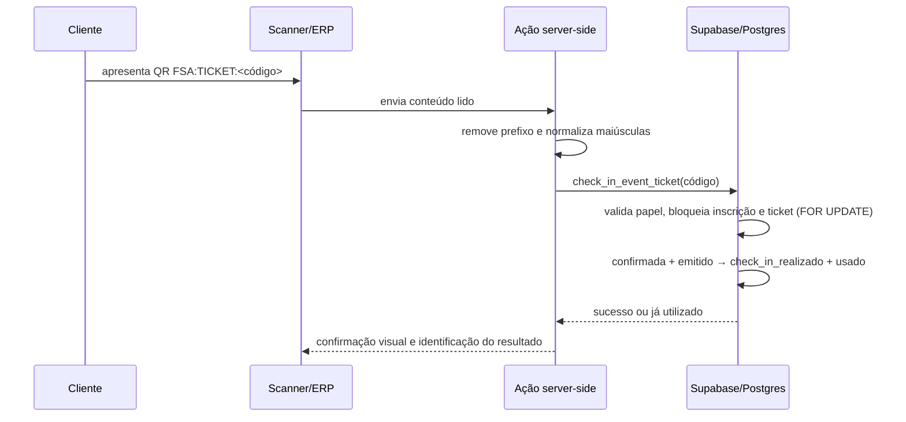

# Guia técnico — permissões setoriais, Construtor de Tabelas e fluxos QR

## Objetivo e escopo

Este guia descreve a estrutura já presente na plataforma ATLETICA FSA e os ajustes recomendados antes de expandi-la. O objetivo é manter três propriedades: **isolamento entre setores**, **integridade dos dados configuráveis** e **operações de check-in/retirada que não aceitem duplicidade**.

> Regra central: autorização deve ser decidida no servidor e reafirmada no banco por RLS. A interface apenas orienta o usuário; ela não é a fonte de verdade da permissão ou da transição de estado.[5]

## 1. Construtor de Tabelas: modelo recomendado

O nível atual usa uma arquitetura de metadados e registros JSONB, apropriada para que cada diretoria configure suas próprias tabelas sem alterar o código da aplicação. Há cinco entidades: `custom_tables`, `custom_table_fields`, `custom_table_records`, `custom_table_views` e `audit_logs`.[1]

| Entidade | Responsabilidade | Campos decisivos |
|---|---|---|
| `custom_tables` | Define a tabela de negócio e seu setor proprietário. | `sector_id`, `name`, `slug`, `deleted_at`. |
| `custom_table_fields` | Define o esquema que a interface deve exigir. | `field_type`, `config_json`, `is_required`, `sort_order`. |
| `custom_table_records` | Armazena os valores flexíveis do registro. | `table_id`, `data_json`, autores, lixeira. |
| `custom_table_views` | Salva filtros e ordenações de uma visão. | `view_type`, `filter_json`, `sort_json`. |
| `audit_logs` | Preserva autoria e antes/depois das mudanças. | `sector_id`, entidade, ação, JSON anterior/posterior, ator. |

### 1.1 Padrão de criação de tabelas

Cada setor deve iniciar com **até três tabelas operacionais**, antes de liberar novos formatos visuais. Isso evita um catálogo sem padrão, simplifica o treinamento e ajuda a definir quais campos realmente importam.

| Setor | Primeira tabela | Campos mínimos | Segunda tabela | Terceira tabela |
|---|---|---|---|---|
| Suprimentos | Solicitações de compra | título, solicitante, fornecedor, valor, status, vencimento | Fornecedores | Inventário de apoio |
| Eventos | Plano de produção | atividade, responsável, prazo, status, custo | Escala de equipe | Orçamento do evento |
| Sociais | Projetos e parcerias | título, parceiro, responsável, status, prazo | Ações sociais | Contatos institucionais |
| Marketing | Calendário de conteúdo | título, canal, responsável, data, status | Banco de ativos | Briefings |
| Esportes | Planejamento de equipes | modalidade, atleta/responsável, status, data | Competições | Viagens e logística |

Padronize, sempre que aplicável, os campos **Título**, **Status**, **Responsável**, **Data/Prazo**, **Observações** e **Anexos/URL**. Hoje os tipos disponíveis são `text`, `number`, `date`, `single_select`, `multi_select`, `person` e `checkbox`; `config_json` deve guardar opções de seleção, valores padrão e ajuda de preenchimento.[1]

### 1.2 Visões

A visão tabular é a única que deve ser liberada de imediato. As visões `kanban`, `calendar` e `gallery` já existem como metadados, mas a renderização operacional ainda deve aguardar a definição das tabelas prioritárias.

| Visão | Pré-requisito de campo | Regra de configuração |
|---|---|---|
| Tabela | Nenhum. | Sempre disponível. |
| Kanban | Um `single_select` de status. | Mapear colunas às opções do campo; limitar WIP se necessário. |
| Calendário | Um `date` ou intervalo início/fim. | Definir timezone institucional e comportamento para data vazia. |
| Galeria | URL de imagem ou futuro campo de anexo. | Não usar para dados sem mídia; definir imagem de fallback institucional. |

## 2. Permissões granulares por setor

O modelo combina um papel global operacional (`admin`, `caixa`, Backoffice) com a governança organizacional: **Presidente**, **Diretor**, **Membro** e **Visualizador**. A associação ativa está em `sector_memberships`; permissões excepcionalmente delegadas ficam em `permission_grants`.[2]

| Perfil organizacional | Alcance recomendado | Permissões no Construtor |
|---|---|---|
| Presidente | Toda a organização. | Cria setores, nomeia diretores, concede/revoga grants, lê auditoria e administra qualquer tabela. |
| Diretor do setor | Somente o próprio setor. | Cria tabelas, campos e visões; cria/edita/arquiva registros; administra a equipe setorial conforme política. |
| Membro | Somente tabelas explicitamente delegadas. | `ver`, `criar` e/ou `editar`; `apagar` somente se for imprescindível. |
| Visualizador | Somente leitura. | `ver`; nenhuma permissão de escrita. |
| Admin global operacional | ERP geral conforme papel técnico. | Não deve receber automaticamente administração de tabelas de todos os setores, salvo se também for Presidente ou Diretor/grant. |

### 2.1 Chaves de recurso e concessão de menor privilégio

Use as ações canônicas `ver`, `criar`, `editar` e `apagar`. Uma concessão deve ser válida somente enquanto `revoked_at IS NULL`; revogação deve manter o histórico, e nunca apagar o grant.[2]

| Escopo de `resource_key` | Uso permitido | Exemplo |
|---|---|---|
| `table:<uuid>` | Delegação a uma tabela específica. | Membro pode editar a tabela de Escala, não o Orçamento. |
| `table:*` | Todas as tabelas **do setor indicado em `sector_id`**. | Coordenador de Eventos cadastra registros em qualquer tabela de Eventos. |
| `*` | Evitar para usuários comuns; reservar para exceção administrativa rastreável. | Não usar para membros ou visualizadores. |

O desenho atual de `can_table_action()` já combina Presidência, diretoria do setor e grants explícitos. Porém, a consulta atual considera `resource_key`, mas **não associa explicitamente `permission_grants.sector_id` ao setor da tabela**.[1] Antes de conceder `table:*`, recomenda-se alterar a função para exigir que o grant tenha `sector_id` nulo apenas para uma exceção global autorizada, ou igual ao `custom_tables.sector_id` da tabela solicitada.

```sql
-- Regra conceitual que deve integrar can_table_action(p_table_id, p_action)
and (
  g.resource_key = 'table:' || t.id::text
  or (g.resource_key = 'table:*' and g.sector_id = t.sector_id)
  or (g.resource_key = '*' and g.sector_id is null)
)
```

Essa verificação evita que um grant setorial amplo seja interpretado como autorização para todas as tabelas da associação.

### 2.2 Controles que precisam ser corrigidos antes de uso intenso

| Prioridade | Constatação | Ação técnica necessária |
|---|---|---|
| Crítica | O trigger `audit_custom_builder()` grava `lower(tg_op)`; em um `INSERT`, o valor é `insert`, mas a restrição de `audit_logs.action` aceita `create`, `update`, `delete`, `restore` e `move`.[1] | Criar uma migração corretiva que converta `INSERT` para `create` e preserve `UPDATE`/demais ações mapeadas. Testar criação de tabela, campo, registro e visão. |
| Alta | `data_json` é flexível; a validação de tipo acontece na camada de aplicação. Um cliente autorizado a inserir via API do Supabase pode contornar a validação da ação server-side. | Preferir uma RPC `SECURITY DEFINER` de criação/edição que valide o JSON contra `custom_table_fields`; revogar escrita direta ou criar trigger de validação. |
| Alta | Visualizador e membro podem receber grants de escrita se a Presidência assim conceder. | Bloquear concessões de `criar`, `editar` e `apagar` a `visualizador` na ação de administração e na função SQL de concessão. |
| Média | A auditoria é lida somente pela Presidência. | Manter essa política; oferecer aos diretores apenas um relatório resumido de suas próprias tabelas caso exista necessidade formal. |

As tabelas devem permanecer com RLS ativo, políticas `USING` e `WITH CHECK` coerentes e nenhuma chave de serviço exposta no navegador. RLS reduz o risco mesmo quando uma chamada não passa pela interface principal.[5]

## 3. Check-in atômico de ingressos por QR

O check-in atual é uma função PostgreSQL transacional, `check_in_event_ticket(p_check_in_code)`. Ela exige papel `admin` ou `caixa`, normaliza e localiza a inscrição, trava a inscrição e o ingresso com `FOR UPDATE`, valida os estados e atualiza ambos na mesma transação.[3]



| Etapa | Condição obrigatória | Resultado |
|---|---|---|
| Emissão | Inscrição confirmada/paga e ticket emitido. | QR individual disponibilizado ao participante. |
| Leitura | O QR aceita o prefixo `FSA:TICKET:`; a ação o remove e normaliza o código. | O operador não precisa editar o payload. |
| Autorização | Operador autenticado em papel `admin` ou `caixa`. | Tentativa não autorizada falha no banco. |
| Bloqueio | Inscrição e ticket são selecionados `FOR UPDATE`. | Leituras concorrentes para consumo aguardam o fim da transação.[6] |
| Transição | Inscrição deve estar `confirmada`; ticket deve estar `emitido`. | Grava `check_in_realizado`, `checked_in_at`, `checked_in_by`, `usado` e `used_at`. |
| Repetição | Inscrição já em `check_in_realizado`. | Retorna `already_checked_in = true`, sem consumi-la de novo. |

### Passos de configuração e aceite

1. Crie e publique o lote de ingresso, com quantidade, preço e período de venda definidos.
2. Confirme que a liquidação de pagamento emite o ticket e deixa a inscrição em estado `confirmada`.
3. Disponibilize a tela `/admin/eventos` apenas a usuários `admin` ou `caixa`; o QR não deve permitir check-in anônimo.
4. Conceda a câmera do dispositivo de leitura, valide leitura manual como contingência e registre o usuário operador.
5. Execute teste de concorrência com duas telas lendo o mesmo QR: uma deve concluir; a outra deve retornar **já utilizado**.
6. Teste os retornos inválidos: código inexistente, ingresso não pago, ingresso cancelado e operador sem papel.

`FOR UPDATE` impede que duas transações alterem ou bloqueiem concorrentemente a mesma linha até o término da transação; essa é a propriedade que torna a dupla leitura segura.[6]

## 4. Retirada de pedido por QR ou código

O fluxo de retirada usa `orders.pickup_code`, `pickup_qr_token`, `picked_up_at` e `picked_up_by`. O pedido nasce com código de retirada, passa pelo estoque/pagamento e somente mostra QR ao cliente quando está `pronto` e o fulfillment é `retirada`.[4]

| Momento | Responsável | Controle atual |
|---|---|---|
| Criação do checkout | Servidor/RPC. | Cria pedido e reserva estoque de forma atômica. |
| Pagamento aprovado | Webhook Mercado Pago/RPC. | Baixa reserva e altera o pedido de maneira idempotente. |
| Pedido pronto | Backoffice/ODS. | Pedido fica elegível para retirada; cliente vê QR e código. |
| Entrega no balcão | Backoffice. | ODS exige correspondência exata do `pickup_code` antes de `pronto → entregue`. |
| Registro final | API ODS. | Grava `picked_up_at`, `picked_up_by` e histórico; a atualização também condiciona o estado anterior para evitar sobrescrita concorrente.[7] |

### Procedimento do operador

1. Abra o ODS com sessão de Backoffice autorizada e localize somente pedidos em `pronto`.
2. Escaneie o QR ou digite o código que o cliente apresenta. No desenho atual, o QR é a representação do próprio `pickup_code`; trate-o como um segredo de apresentação.
3. Confira itens, nome/identificador permitido pela política de atendimento e código apresentado.
4. Faça a transição para `entregue` apenas no endpoint do ODS. O cliente não pode encerrar o pedido por conta própria.
5. Se o pedido já tiver sido entregue ou não estiver pronto, interrompa a entrega e siga o procedimento de exceção; não force o estado pela interface ou pelo banco.

### Endurecimento recomendado para QR de retirada

O QR atual é operacionalmente suficiente, mas não é um token assinado. Para uma operação com maior volume, substitua o payload visível por um identificador opaco de alta entropia, associado a expiração e uso único.

| Melhoria | Implementação | Ganho |
|---|---|---|
| Token opaco | Renderizar `pickup_qr_token`, não o código de retirada. Guardar somente o hash do token quando possível. | Evita códigos curtos/legíveis como única credencial. |
| RPC única de retirada | `confirm_pickup_by_qr(token)` com `FOR UPDATE`, estado `pronto`, fulfillment `retirada` e operador autenticado. | Centraliza validação e transição. |
| Expiração/rotação | Gerar novo token se pedido voltar a pronto ou após janela definida. | Reduz reuso de captura de tela antiga. |
| Idempotência | Se `picked_up_at` já existir, retornar `already_picked_up`. | Evita entrega duplicada e torna retry seguro. |
| Auditoria | Gravar IP/dispositivo quando disponível, operador e correlação do pedido. | Facilita apuração de divergências. |

## 5. Sequência de implantação segura

| Ordem | Entrega | Critério de aceite |
|---|---|---|
| 1 | Migração corretiva de auditoria e escopo setorial de grants. | Criação no Builder funciona e um grant de Eventos não libera Suprimentos. |
| 2 | RPC/trigger de validação de `data_json`. | Registros inválidos não entram por API direta. |
| 3 | Configurar três tabelas iniciais de cada setor. | Campos, responsáveis e status aprovados pelos diretores. |
| 4 | Treinar Presidente e Diretores. | Eles conseguem conceder/revogar acesso sem editar SQL. |
| 5 | Testar check-in duplicado e retirada concorrente. | Uma única transição efetiva e log do operador. |
| 6 | Evoluir QR de retirada para token opaco. | QR antigo não permite retirada após rotação/expiração. |

## Referências

[1]: https://github.com/Mos754763/Atletica-Fsa/blob/main/supabase/migrations/20260814150000_table_builder_audit_trash.sql "Migração do Construtor de Tabelas"
[2]: https://github.com/Mos754763/Atletica-Fsa/blob/main/supabase/migrations/20260814120000_sector_governance.sql "Migração de governança setorial"
[3]: https://github.com/Mos754763/Atletica-Fsa/blob/main/supabase/migrations/20260814161000_atomic_ticket_checkin.sql "Função atômica de check-in"
[4]: https://github.com/Mos754763/Atletica-Fsa/blob/main/supabase/migrations/20260814130000_commerce_variants_pickup_reservations.sql "Reserva de estoque e retirada"
[5]: https://supabase.com/docs/guides/database/postgres/row-level-security "Supabase — Row Level Security"
[6]: https://www.postgresql.org/docs/current/explicit-locking.html "PostgreSQL — Explicit Locking"
[7]: https://github.com/Mos754763/Atletica-Fsa/blob/main/src/app/api/ods/orders/route.ts "Rota ODS de entrega"
